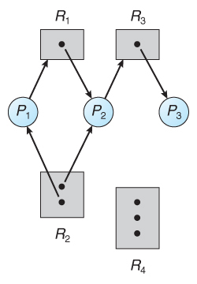

# Resource Allocation Graph

The resource allocation graph is the pictorial representation of the state of a system. As its name suggests, the resource allocation graph is the complete information about all the processes which are holding some resources or are waiting for some resources. It also contains information about all the instances of all the resources whether they are available or are being used by the processes. In the Resource allocation graph, the process is represented by a Circle while the Resource is represented by a rectangle.

Here, a set of resource categories, {$$R1, R2, R3, R4$$}, appears as square nodes on the graph. Dots inside the resource nodes indicate specific instances of the resource. \(For eg: two dots might represent two laser printers.\) The set of processes be {$$P1, P2, P3, P4$$}.

**Request Edges** - A set of directed arcs from $$Pi$$ to $$Rj$$, indicating that process $$Pi$$ has requested $$Rj$$ and is currently waiting for that resource to become available.

**Assignment Edges** - A set of directed arcs from $$Rj$$ to Pi indicating that resource $$Rj$$ has been allocated to process $$Pi$$ and that $$Pi$$ is currently holding resource $$Rj$$.

The request edge can be converted into an assignment edge by reversing the direction of the arc when the request is granted. \(However, the request edges point to the category box, whereas assignment edges emanate from a particular instance dot within the box\).

* If a resource-allocation graph does contain cycles AND each resource category contains only a single instance, then a deadlock exists.

* If a resource-allocation graph does contain cycles AND each resource category contains only a single instance, then a deadlock exists.

* If a resource category contains more than one instance, then the presence of a cycle in the resource-allocation graph indicates the possibility of a deadlock; but does not guarantee one.

